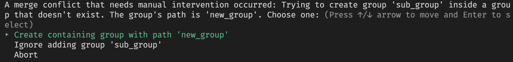

<p align="center">
  
</p>

# Kintsugi [](https://github.com/rubocop/rubocop)

## What is this?

One of the frustrations of working with Xcode together with Git is resolving conflicts in Xcode project files, i.e. the `project.pbxproj` file.

Kintsugi sets out to solve this exact problem: Automatically resolving Git merge conflicts occurring in `.pbxproj` files.

The end goal is for the tool to succeed 99.9% of the time, and let you resolve the real conflicts in a convenient way the rest of the time.

> Kintsugi (金継ぎ) is the art of repairing broken pottery by mending it with gold. [Wikipedia](http://en.wikipedia.org/wiki/Kintsugi)

## How?

Kintsugi understands the changes you've made to the `.pbxproj` file, so it simply resets the conflicts and re-applies those changes to it.

From a technical perspective, Kintsugi heavily relies on [Xcodeproj](https://github.com/CocoaPods/Xcodeproj). It uses its diff capability to extract the changes, and uses its project files editing capabilities to apply the changes.

## Installing Kintsugi

```sh
$ gem install kintsugi
```

If you prefer to use bundler, add the following line to your Gemfile:

```rb
gem 'kintsugi', require: false
```

## Usage

When there's a `.pbxproj` file with Git conflicts, and a 3-way merge is possible, run `kintsugi <path_to_pbxproj_file>`.

And see the magic happen! :sparkles:

### Interactive conflict resolution

In case Kintsugi cannot resolve a conflict on its own, it will display a helpful message describing the conflict and choices to resolve it:



This feature can be disabled by passing the `--interactive-resolution false` flag.

### Git merge driver

You can setup Kintsugi to automatically resolve conflicts that occur in `pbxproj` files when such conflicts occur.

#### Automatic install

Run `kintsugi install-driver`. This will install Kintsugi as a merge driver globally. Note that Kintsugi needs to be in your `PATH`.

- Note: You can pass arguments to this command which will then be passed on to Kintsugi when it's executed as a merge driver. For example, you can pass `--interactive-resolution false` to disable interactive conflict resolution.

❗ Do not install with bundler because the installation might succeed even if Kintsugi is not in `PATH`.

#### Manual install

- Add Kintsugi as driver to Git config file by running the following:
```sh
git config merge.kintsugi.name "Kintsugi driver" # Or any other name you prefer
git config merge.kintsugi.driver "<path_to_kintsugi> driver %O %A %B %P"
```

Run `git config` with `--global` to add this to the global config file.

- Add the following line to the `.gitattributes` file at the root of the repository:

`*.pbxproj merge=kintsugi`

This will instruct Git to use Kintsugi as a merge driver for `.pbxproj` files.

See the [official docs](https://git-scm.com/docs/gitattributes) if you want to set this globally.

## Contribution

See our [Contribution guidelines](./CONTRIBUTING.md).

## Alternatives

All of the alternatives below allow you to generate your Xcode projects based on a spec or manifest. You commit these files to git, and can even remove the `.xcodeproj` files from git.

- [XcodeGen](https://github.com/yonaskolb/XcodeGen)
- [Tuist](https://github.com/tuist)
- [Xcake](https://github.com/igor-makarov/xcake)

## Copyright

Copyright (c) 2021 Lightricks. See [LICENSE](./LICENSE) for details.
